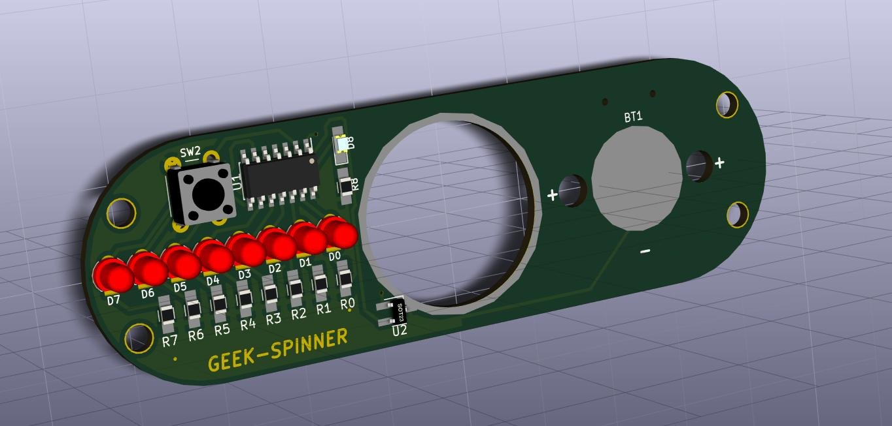

# Geek-Spinner
POV Spinner

Based on this project: 
	
	- Title:	GEEK SPINNER	
	- Author:	MakersBox
	- Link:		http://www.instructables.com/id/Geek-Spinner/

**BOM**

	- Attiny84-20SSU
	- 8 x 3 mm Red leds
	- SMD Blue led
	- 8 x 330mOhms resistors
	- Push button
	- CR2032 battery holder: 	https://lcsc.com/product-detail/Battery-Holders-Clips-Contacts_CR2032Curved-feet-3V_C70373.html
	- 2 x 0.1uF capacitors
	- TLE4906 Hall sensor: 		https://lcsc.com/product-detail/Sensors_Infineon_TLE4906KHTSA1_TLE4906KHTSA1_C126652.html
	- SMD switch : 			https://lcsc.com/product-detail/Toggle-Switches_9mm-3-5mm_C92658.html
	- 2x3 header: 			https://lcsc.com/product-detail/Male-Header_Headers-Pins-2-3P-2-54mm-SMD_C124390.html
	- 608 bearing: 			https://www.aliexpress.com/item/New-High-Speed-608-Hybrid-Ceramic-Center-Bearing-For-Fidget-Hand-spinner-ToyBBC/32817310812.html?spm=a2g0s.9042311.0.0.Zu7Bp7
	- 2x1mm neodynium magnet:	https://www.aliexpress.com/item/Free-shipping-10PCS-magnets-2mmx1mm-Tiny-Disc-Neodymium-Rare-Earth-Magnet-2x1-Craft-Model-2-1/32719568312.html?spm=a2g0s.9042311.0.0.u8fnqV

**3D Model**

**Video**

